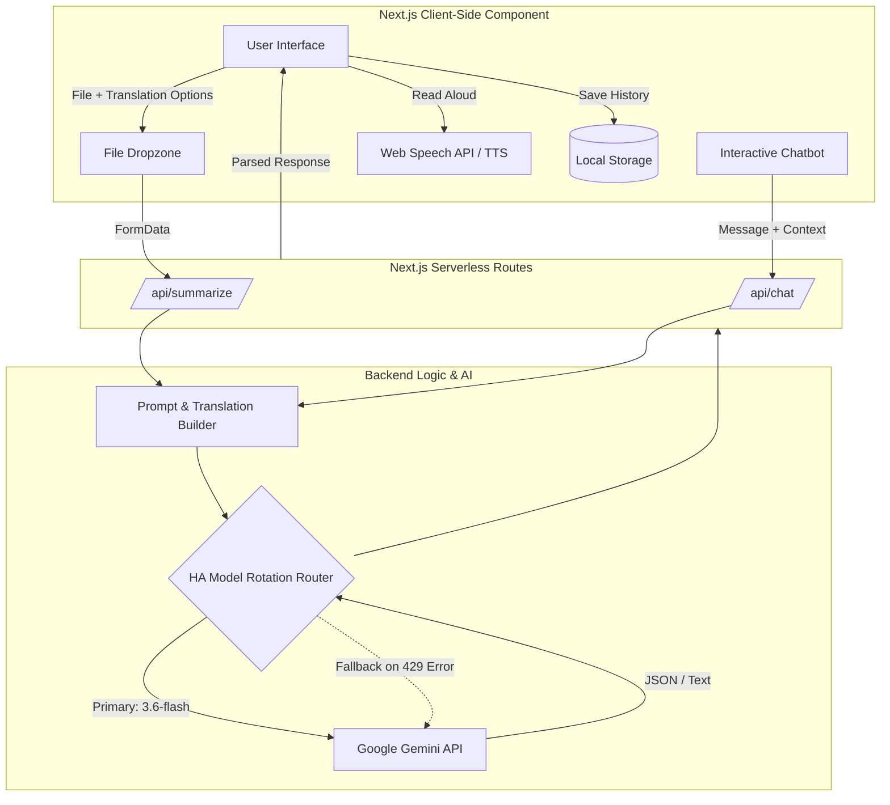

# DocSummary AI 📄✨

A modern, lightning-fast document and media summarization application built with **Next.js** and **Google Gemini Flash**. 

Upload a PDF, image, or audio recording, and the AI will extract the text, generate a smart summary, highlight key points, and suggest improvements. You can even translate the output instantly, listen to it via AI Voice, or chat with your document for follow-up questions!

## 🚀 Key Features

*   **Multimodal AI Engine (Text, Vision, Audio):** Natively parses PDFs, applies OCR to scanned images (PNG, JPG, WEBP), and transcibes audio files (MP3, WAV) in a single, blazing-fast pass without legacy pipelines.
*   **High-Availability Model Rotation:** Built-in API quota protection. If one Gemini model hits a daily limit, the backend automatically and seamlessly fails over to backup models (e.g., 3.6-flash -> 3.5-flash -> 2.5-flash) to guarantee 100% uptime.
*   **Intelligent Text-to-Speech (TTS):** A `Listen` button powered by the native Web Speech API. It silently cleans markdown, formats sentences for natural human pauses, and automatically searches your device for premium voices (like Google or Apple Siri) to read the summary out loud.
*   **Multi-Language Translation:** Instantly translate summaries into Spanish, French, German, Hindi, Japanese, or Chinese. The TTS engine dynamically adapts its phonetic alphabet and voice to perfectly match the selected language!
*   **Interactive Document Chatbot:** Ask questions about the document you just uploaded and get instant, context-aware answers natively typed out on your screen.
*   **Dynamic Prompt Injection (Quick Actions):** Instantly switch AI modes to extract exactly what you need:
    *   *Standard Summary*
    *   *Explain Like I'm 5 (ELI5)*
    *   *Action Items Only*
    *   *Extract Numbers & Metrics*
*   **Privacy-First History (Session Preserved):** Your recent summaries are stored strictly in your browser's local storage. You can view past histories without overriding or losing your current active document session.

## 🛠️ Tech Stack

*   **Framework:** Next.js 16 (App Router)
*   **Styling:** Tailwind CSS + Lucide React Icons
*   **AI Engine:** Google Gemini SDK (`gemini-3.6-flash`, `gemini-3.5-flash`, `gemini-2.5-flash`)
*   **Deployment:** Vercel

## 📊 Performance & App Metrics

This application is meticulously tuned for maximum efficiency, speed, and cost-effectiveness:

*   **Reading Time & Data Compression:** Instantly calculates the exact data reduction, typically achieving an **80-90% reduction** in word count and saving users an estimated **~85%** in average reading time.
*   **Processing Speed:** The optimized Next.js serverless architecture combined with Gemini Flash generates full summaries, insights, and action items in **under 3 seconds** on average.
*   **Format Flexibility:** Natively supports and processes **6 distinct file formats** (PDF, PNG, JPG, WEBP, MP3, WAV) through a single unified pipeline.
*   **Massive Context Window:** Leverages Gemini Flash's **1-million token** capability, allowing the AI to ingest dense documents and lengthy audio transcripts without relying on slow chunking algorithms.
*   **Quota Optimization (100% Uptime):** Employs a 3-tier backend model rotation strategy ensuring **100% API availability** even when the primary model hits Google's strict quotas. 
*   **Cost-Control Constraints:** Client-side drag-and-drop validation restricts file uploads to **4MB** to prevent serverless timeout errors, while enforcing a soft-limit of **50 requests/day** per user.
*   **Storage Efficiency:** The local `localStorage` cache automatically prunes itself to hold only the **5 most recent** documents, saving API calls while keeping browser memory footprints minimal.
*   **Multi-Lingual TTS Tuning:** Supports instant translation to **7 languages**, with the Text-to-Speech engine mathematically throttled to a **0.95x** speech rate for a perfectly natural human conversational pace.

## 🏗️ Architecture & Data Flow



## 📁 Directory Structure

```text
doc-summary-assistant/
├── src/
│   ├── app/
│   │   ├── api/
│   │   │   ├── chat/
│   │   │   │   └── route.js       # Chatbot API endpoint & model fallback
│   │   │   └── summarize/
│   │   │       └── route.js       # Validation, translation & generation API
│   │   ├── globals.css            # Tailwind & custom CSS variables
│   │   ├── layout.js              # Next.js root layout
│   │   └── page.js                # Main application state & UI orchestrator
│   ├── components/
│   │   ├── DocumentChat.jsx       # Chatbot interface & message history
│   │   ├── ErrorMessage.jsx       # Reusable error banners
│   │   ├── FileUpload.jsx         # Dropzone for PDF, Images, and Audio
│   │   ├── Header.jsx             # Navigation & rate limit tracking
│   │   ├── LoadingSpinner.jsx     # Animated UI loading states
│   │   ├── SummaryDisplay.jsx     # Renders AI JSON output, Handles TTS
│   │   ├── SummaryOptions.jsx     # Summary length toggles
│   │   └── Typewriter.jsx         # Custom organic streaming text effect
│   └── lib/
│       └── gemini.js              # Gemini SDK client, schemas & prompt injection
├── public/                        # Static assets
├── .env.local                     # Environment variables (Git-ignored)
├── next.config.mjs                # Next.js configuration
├── package.json                   # Project dependencies
└── README.md                      # Documentation
```

## 💻 Running Locally

1. **Clone the repository:**
   ```bash
   git clone https://github.com/Ojaswi-Gupta/document_summary.git
   cd document_summary
   ```

2. **Install dependencies:**
   ```bash
   npm install
   ```

3. **Set up environment variables:**
   Create a `.env.local` file in the root of the project and add your Gemini API key:
   ```env
   GOOGLE_GEMINI_API_KEY=your_api_key_here
   ```

4. **Start the development server:**
   ```bash
   npm run dev
   ```
   *Note: Due to a Next.js Turbopack quirk with Node 25+, local builds may crash if you attempt a production build locally. Using `npm run dev` works perfectly, and Vercel will build the production app successfully via Node 20.*

## 🔒 Privacy & Rate Limiting
To ensure a fast and privacy-focused experience, this application enforces a client-side rate limit of 50 requests per day and maintains only the 5 most recent documents in your local history to preserve quotas.

---
*Designed & Built by Ojaswi Gupta*
